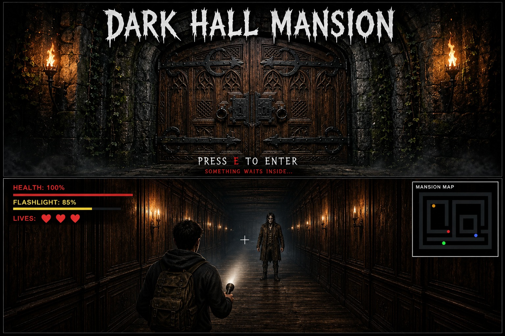

# Dark Hall Mansion

## 🎮 About the Game

Dark Hall Mansion is a first-person horror exploration game set inside a mysterious and abandoned mansion.

The player must explore the mansion, find hidden keys, solve puzzles, unlock restricted areas, and escape while being chased by a dangerous ghost. The game combines exploration, puzzle-solving, suspense, and survival mechanics.

---

## 📖 Game Story

The game begins at the main entrance of the Dark Hall Mansion.

Once the player opens the entrance door, they enter the mansion and begin exploring its dark corridors and rooms. A mansion map helps guide the player by showing important locations, including where keys can be found.

The player must collect keys and progress through different areas of the mansion while avoiding the ghost.

---

## 🎯 Objective

The main objective is to:

1. Enter the Dark Hall Mansion.
2. Explore the corridors using the mansion map.
3. Find the required keys.
4. Escape from the ghost when it becomes active.
5. Unlock and enter the library.
7. Solve the book-arrangement puzzle.
8. Obtain the basement key.
9. Survive another ghost chase.
10. Reach the basement and escape.

---

## 🕹️ Gameplay

### 1. Enter the Mansion

The player starts at the main entrance door. Opening the door allows the player to enter the mansion.

Inside the mansion, the player can explore different corridors and rooms.

### 2. Find the First Key

The mansion map helps the player navigate the building and locate important items.

The  orange colour oon the mansion map represents the location of the key.

The player follows the map to find the key.

### 3. Ghost Chase

As soon as the player collects the key, the ghost becomes active.

The ghost begins chasing the player, so the player must run through the mansion and reach the library.

### 4. Unlock the Library

The library door requires a code.

The correct code is:

1947

After entering the correct code, the player can enter the library, and the ghost disappears.

### 5. Solve the Library Puzzle

Inside the library, the player must arrange a set of books in the correct sequence.

The books are numbered 1, 2, 3, and 4, and the player must discover the correct arrangement to complete the puzzle.
 
The  correct arrangement is:

3142

Once the puzzle is solved, the player receives the basement key.

### 6. Second Ghost Chase

After obtaining the basement key, the ghost becomes active again.

The player must escape from the ghost and make their way toward the basement.

### 7. Escape Through the Basement

The final objective is to reach the basement and escape from the mansion.

Successfully reaching the escape point completes the game.

---

## 👻 Ghost & Lives System

The game includes a survival system with 3 lives.

If the ghost catches the player, the player is held for approximately 5 seconds, after which one life is lost.

- ❤️❤️❤️ — Three lives remaining
- ❤️❤️ — Two lives remaining
- ❤️ — One life remaining
- No lives remaining — Game Over

The player must carefully navigate the mansion and avoid being caught by the ghost.

---

## 🗺️ Mansion Map

The mansion map helps the player navigate through the corridors and locate important objectives.

It provides information about where important items, such as keys, can be found, allowing the player to plan their route through the mansion.

---

## 🔑 Items

### Key

Keys are essential for progressing through the mansion and unlocking new areas.

### Lock

Locks are used to restrict access to certain areas until the player has completed the required objective.

---

## 🎵 Sound Design

The game includes different sounds and music to create a suspenseful horror atmosphere.

The assets include:

- Background music
- Ghost chasing music
- Key/jingle sound
- footstep sound
- gameover music
- Door-opening sound

These sounds help provide audio feedback and increase tension during gameplay.

---

## 🖼️ Assets

The project contains a dedicated "assets" folder with separate categories for game resources.

### Textures

The texture assets include:

- Wall
- Door
- Ceiling
- Floor
- Wood wall
- locked door

### Enemy

Contains the visual asset used for the ghost/enemy.

### Items

Contains item images such as:

- Key
- Lock
- candle 
- medkit


### Sounds

Contains the game's background music and gameplay sound effects.

---

## 📁 Project Structure
```text
Dark Hall Mansion/
│
├── game.py
├── mansion_map.py
├── menu.py
├── settings.py
├── enemy.py
├── player.py
├── main.py
├── renderer.py
├── raycasting.py
│
└── assets/
    │
    ├── items/
    │   ├── key
    │   └── lock
    │
    ├── enemy/
    │   └── ghost
    │
    ├── textures/
    │   ├── wall
    │   ├── door
    │   ├── ceiling
    │   ├── floor
    │   ├── wood wall
    │   └── locked door
    │
    └── sounds/
        ├── background music
        ├── chasing music
        ├── key/jingle sound
        ├── chase sound
        └── door-opening sound
        └── game over

```
---

## 🧩 Core Game Features

- First-person mansion exploration
- Ray-casting based rendering
- Mansion navigation and map system
- Key and lock mechanics
- Ghost AI and chase system
- Library door code puzzle
- Book-arrangement puzzle
- Multiple lives
- Atmospheric background music
- Chase and interaction sound effects
- Basement escape objective

---

## 🏆 Winning the Game

The player wins by successfully completing the required objectives, obtaining the basement key, surviving the final ghost chase, and escaping through the basement.

---

## 💀 Game Over

The game ends when the player loses all three lives after being caught by the ghost.

---

🚀 Future Improvements

Possible future improvements could include:

- Additional mansion rooms and puzzles
- More enemy types
- More detailed enemy AI
- Additional difficulty levels
- More interactive objects
- Improved visual effects
- Additional endings and story elements
- Save and load functionality

---

##  📸 Game Screenshot




---

## 📌 Conclusion

Dark Hall Mansion is designed to combine exploration, puzzle-solving, and survival horror. Players must carefully explore the mansion, solve puzzles, collect important items, and escape the ghost while managing their limited lives.

The game focuses on creating an immersive and suspenseful experience through ray-casting visuals, environmental textures, atmospheric music, sound effects, puzzles, and enemy chase mechanics.